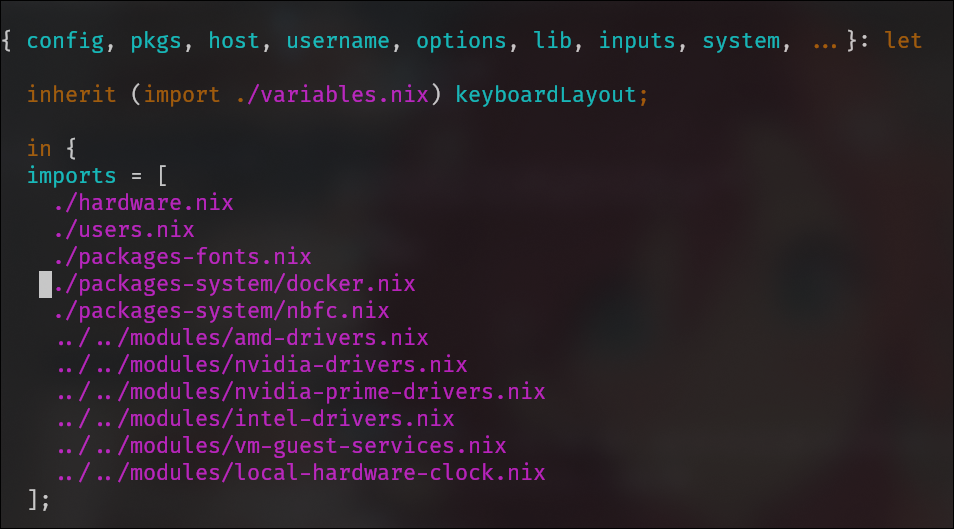
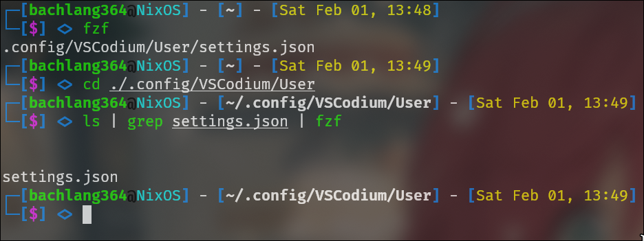

# 📁 Cấu hình thư mục

## 🔧 .vscode-oss
Tổng hợp các extension đã tích hợp trong VSCodium. Bạn có thể vào thư mục để xem chi tiết.

### Hướng dẫn cài đặt:
1. Copy thư mục này vào đường dẫn:
   
```bash
/home/$username/
```

Tìm $username của hệ thống bằng một trong hai lệnh:
   
```bash
echo $USER
```
# hoặc
```bash
whoami
```

## 🏠 Home-Manager
Tổng hợp các gói dữ liệu và phần mềm đã cài đặt với quyền user hệ thống.

### Cài đặt và cấu hình:
1. Copy vào thư mục:
```bash
/home/$username/
```

2. Lưu ý:
- Đây là nơi chứa file cấu hình home-manager (có thể thay đổi đường dẫn tùy ý)
- Thay đổi tên user `bachlang364` thành tên user của bạn trong file cấu hình

>📝 Hãy chạy lệnh `cd` để vào thư mục chứa flake trong Home-manager nhá
3. Kích hoạt cấu hình:
```bash
home-manager switch --flake .#$username
```

## 🖼️ list-png
Bộ sưu tập hình ảnh được sử dụng làm hình nền máy tính.
> 💡 Nếu bạn có những bức ảnh đẹp, hãy chia sẻ nhé!

## ⚙️ package-system
Các gói dữ liệu và phần mềm yêu cầu quyền admin hệ thống.

### Cách thêm vào cấu hình:
1. Thêm vào file cấu hình hệ thống nix
   
2. Chú ý 2 đường dẫn quan trọng:
- `./packages-system/docker.nix`
- `./packages-system/nbfc.nix`
  
> 📝 `./` là thư mục hiện tại đang trỏ tới cấu hình hệ thống

## ⚡ settings.json
File cấu hình cho VSCode/VSCodium.

### Cách áp dụng:
1. **Cách 1**: 
   - Mở VSCode → Settings → Open Settings (JSON)
   - Paste nội dung file vào

2. **Cách 2**:
   - Paste trực tiếp vào đường dẫn mà VSCode đang link tới
  
    